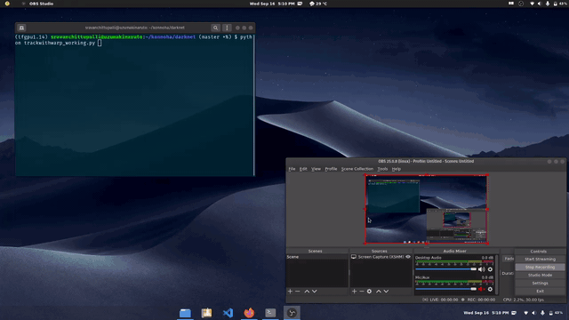
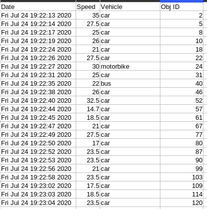
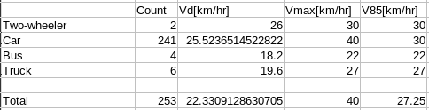

# Traffic-Monitoring 🚛 🚴🏽

## Contents
- [Why this project](#why-this-project)
- [About the Project](#about-the-project)
- [Tech Stack](#tech-stack)
- [How to run the application](#how-to-run-the-application)
- [Demo](#demo)
- [Stats Generated](#stats-generated)
- [References](#references)
- [License](#license)

## Why this project
- According to the Insurance Information Institute, nearly 17 percent of all traffic crashes in 2017 and 26 percent of all traffic fatalities were caused by speeding. Authorities need better solutions to tackle the problem of speeding.

- Thus I've tried to provide a solution for this. CCTV cameras are available on roads for surveillance we can also use them to calculate speed of a vehicle without any extra hardware.

- The statestics like traffic flow, peak hours are really important as they ensure smooth flow of traffic. This data can also be generated with the help of cameras on roads without any extra cost.

## About the Project

In this project I've made a speed detection algorithm that can track a car and generate the approximate speed. For better results I've used the eagle eye perspective of the ROI. Also after processing the whole video a .csv file is generated containing log og every vehivle that passed through and algo in general statistics like no. of speed violations, avg speed, V85 speed, gap between 2 vehicles, etc. These statistics can be used by authorities to understand the traffic in the region.

## Tech Stack
* [Python](https://www.python.org/)
* [Numpy](https://numpy.org)
* [SciPy](https://pypi.org/project/scipy/1.5.1/)
* [OpenCV](https://opencv.org/)

## How to run the application
This is the problem with darknet. I can't find a way to give the whole project as a package along with darknet. Please do the following steps extremely carefully. 
I strongly recommend the use of miniconda as is keep the system python packages seperate, thus avoiding conflict.

  1) Clone [AlexyAB's darknet](https://github.com/SravanChittupalli/darknet) github repo.
  2) Run the python demo as given in the [README](https://github.com/AlexeyAB/darknet/blob/master/README.md). If you built and ran the demo successfully then continue to step 3
  3) Clone this repo into the `darknet` folder
  4) Next copy `main.py` and `utils` folder into the `darknet` folder.
  7) Download the [weight](https://drive.google.com/drive/u/0/folders/1XVWolAhNTvv-ssePnYNXk0GNMrzmwN0w) file.
  8) Create a `test_videos` folder and add [this video](https://drive.google.com/file/d/1mkYgaZVFr_8oRhazXaL3lZ9SUDLcjQmv/view?usp=sharing) there
  8) Run `python main.py`

## Demo

## Stats Generated

## References
* [AlexyAB's YOLOV4](https://github.com/AlexeyAB/darknet)
* [SORT Implementation](https://github.com/abewley/sort)
* [Point's side w.r.t a line](https://www.geeksforgeeks.org/direction-point-line-segment/)
* Thanks to pyimagesearch. There is are no topics in CV and ImageProcessing that pyimagesearch blog doesnot cover. 

## License
Details can be found in [License](LICENSE). 
